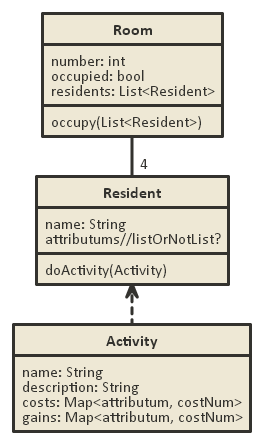
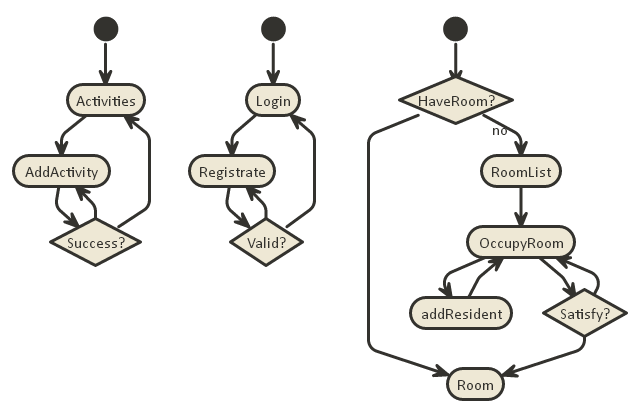
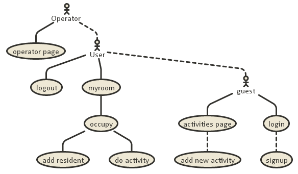
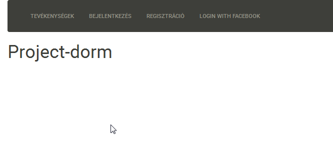
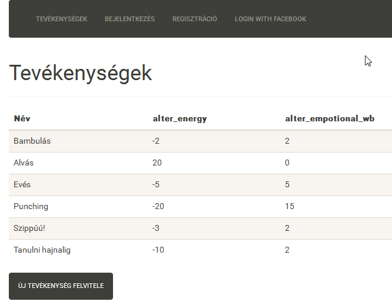
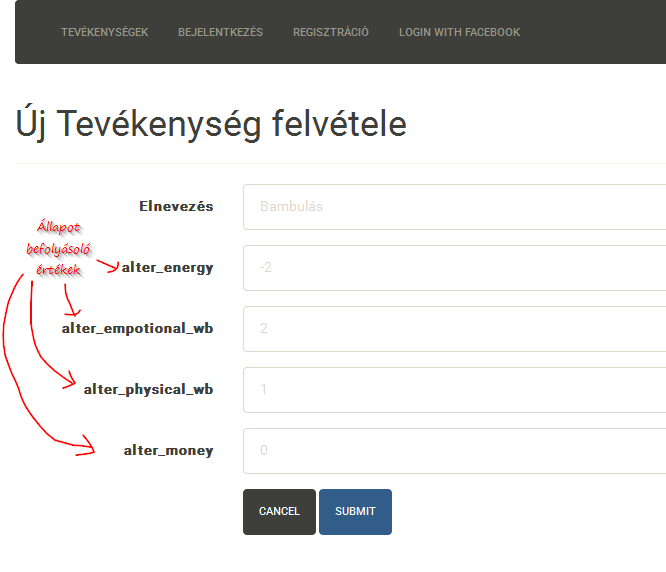
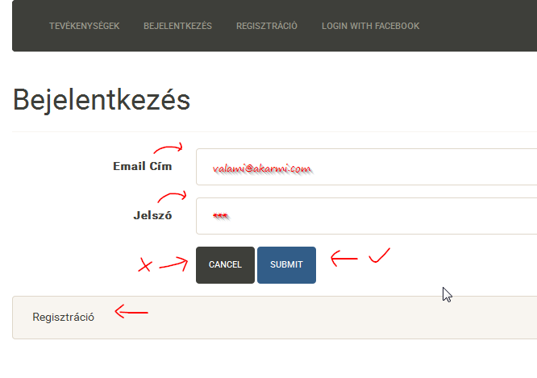

# Project Dorm
## 1. Követelményfeltárás
### 1.1 Összefoglaló
A Project Dorm egy szóval kifejezve egy kollégista-nevelde, viszont ellentétben más neveldékkel itt teljes egészében a felhasználók töltik fel tartalommal a játékteret, jelen pillanatban ez a lakók és a tevékenységek megadását jelenti.
### 1.2 Funkciók
- A felhasználó tudjon:
    * Választani egyet az elérhető szobák közül és abba beköltözni. (szobákat jelenleg az operátor tud felvenni)
    * Szobafoglalást követően tudjon új lakókat hozzáadni a szobához. (a lakó nevének és leírásának megadásával)
    * Új tevékenységeket megadni.(a leírás nevének és állapot befolyásoló hatásainak emgadásával)
    * Tevékenységeket kiadni a lakóinak.
- Az operátor tudjon:
    * Új szobákat felvenni és törölni
    * Új lakókat felvenni és törölni

## 2. Tervezés
### 2.1 Endpoints
Method | URL | description
-------|-----|------------
GET  |  /    |                       főoldal
GET  |  /login        |              bejelentkező oldal
POST |  /login         |             bejelentkezési adatok felküldése
GET  | /login/signup    |           regisztrációs oldal
POST | /login/signup      |         regisztrációs adatok felküldése
GET  | /auth/facebook     |         facebook bejelentkezés oldal
GET  | /auth/facebook/callback  |   facebook callback oldal
GET  | /logout               |      kijelentkezés
GET  | /profile             |       profil oldal
GET  | /profile/change/password |   jelszó változtatás
POST  | /profile/change/password  |  jelszó változtatás
GET  | /activity             |      tevékenység lista
GET  | /activity/new         |      új tevékenység oldal
POST | /activity/new         |      új tevékenység adatainak felküldése
GET  | /myroom               |      saját szoba oldal
POST | /myroom               |      form elküldése, ami kiadja x lakónak y tevékenységet (TODO ezt nagyon nem így kéne)
GET  | /myroom/occupy/:id     |     :id szoba elfoglalása
GET  | /myroom/addresident    |     új lakó hozzáadása
POST | /myroom/addresident    |     új lakó adatainak felküldése
GET  | /operator               |    operátor oldal
GET  | /operator/room               
GET  | /operator/room/new              
GET  | /operator/resident             
GET  | /operator/resident/new              
POST | /operator/resident/new               
GET  | /operator/resident/delete/:id 
### 2.2 Adatmodell

### 2.3 Állapotdiagram

### 2.4 Komponensdiagram

## 3. Implementáció
### 3.1 Fejlesztőkörnyezet
A fejlesztés a [Cloud 9](https://c9.io/) felhő alapú IDE-ben zajlott, illetve lokálisan a JetBrains [WebStorm](https://www.jetbrains.com/webstorm/) IDE-jében. (Valamint funcionális felületi teszt Eclipseben lett megírva Selenium-ot használva, de erre nem vagyok büszke)
### 3.2 Szoftvercsomagok
A webalkalmazás [Node.js](https://github.com/nodejs/node) szoftverrendszer segítségével készült, a felhasznált modulok listája: 
- [bcryptjs](https://www.npmjs.com/package/bcryptjs)
- [body-parser](https://www.npmjs.com/package/bcryptjs)
- [body-parser](https://www.npmjs.com/package/bcryptjs)
- [express](https://www.npmjs.com/package/bcryptjs)
- [express-session](https://www.npmjs.com/package/bcryptjs)
- [express-validator](https://www.npmjs.com/package/bcryptjs)
- [hbs](https://www.npmjs.com/package/bcryptjs)
- [passport](https://www.npmjs.com/package/bcryptjs)
- [passport-facebook](https://www.npmjs.com/package/bcryptjs)
- [passport-local](https://www.npmjs.com/package/bcryptjs)
- [sails-disk](https://www.npmjs.com/package/bcryptjs)
- [sails-memory](https://www.npmjs.com/package/bcryptjs)
- [waterline](https://www.npmjs.com/package/bcryptjs)

## 4. Tesztelés
### 4.1 User Model
Az user model tesztelésére chai és mocha node modulokat használtam, a tesztek a model következő részeit fedik le: 
- regisztráció email/jelszó párral
- regisztráció facebookal
- jelszó módosítás
- user keresése
### 4.2 Funkcionális felületi tesztek
Projekten kívül futtatható Selenium test lefedi a login/signup lépéseket:
- próbál helytelen email/jelszó párral belépni
- próbál helyes email/jelszó párral belépni
- regisztrál egy új felhasználót
## 5. Felhasználói dokumentáció
### 5.1 Oldalak bemutatása
- Főoldal

- Tevékenységek oldal, tevékenységek listája látható, illetve itt lehet új tevékenységet felvenni

- Új tevékenység hozzáadásának az oldala

- Bejelentkezés oldal

