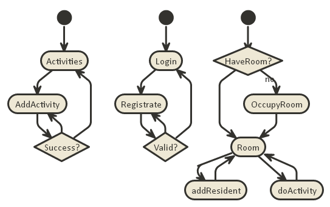

# project-dorm
## Követelményfeltárás
- A felhasználó tudjon választani egyet az elérhető szobák közül. 
- Egy üres szoba kiválasztása után tudjon létrehozni egy lakót név és tulajdonság pontok elosztásával, ezt követően kap maga mellé 3 másik lakót  és lezárhatja a szobafoglalást
- Sikeres szobafoglalás után tevékenységeket oszthat ki a szoba lakóinak, amik hatással vannak az állapotukra(energia, éhség, stb.)
- A felhasználó tudjon további tevékenységeket felvenni
- A felhasználók által felvett új tevékenységeket az operátor tudja elfogadni(elérhetővé tenni a lakóknak)

## Tervezés

### endpoints
- GET   /                           főoldal
- GET   /login                      bejelentkező oldal
- POST  /login                      bejelentkezési adatok felküldése
- GET   /login/signup               regisztrációs oldal
- POST  /login/signup               regisztrációs adatok felküldése
- GET   /auth/facebook              facebook bejelentkezés oldal
- GET   /auth/facebook/callback     facebook callback oldal
- GET   /logout                     kijelentkezés
- GET   /profile                    profil odlal
- GET   /profile/change/password    jelszó változtatás
- GET   /profile/change/password    jelszó változtatás
- GET   /activity                   tevékenység lista
- GET   /activity/new               új tevékenység oldal
- POST  /activity/new               új tevékenység adatainak felküldése
- GET   /myroom                     saját szoba oldal
- POST  /myroom                     form elküldése, ami kiadja x lakónak y tevékenységet (TODO ezt nagyon nem így kéne)
- GET   /myroom/occupy/:id          :id szoba elfoglalása
- GET   /myroom/addresident         új lakó hozzáadása
- POST  /myroom/addresident         új lakó adatainak felküldése
- GET   /operator                   operátor oldal
- GET   /operator/room                   
- GET   /operator/room/new                   
- GET   /operator/resident                   
- GET   /operator/resident/new                   
- POST   /operator/resident/new                   
- GET   /operator/resident/delete/:id                   

### adatmodell

### állapotdiagram

### komponensdiagram

## Implementáció

c9 ide-t használtam.

## Tesztelés

Még hátra van

## Felhasználói dokumentáció

Magától értetődő

Ha mégis kérdésed lenne: support@nemvalidemailcim.com
