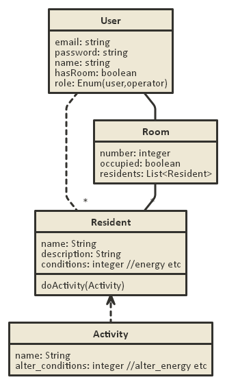

# project-dorm
## Követelményfeltárás
A felhasználó tudjon:
- választani egyet az elérhető szobák közül és abba beköltözni.
- Szobafoglalást követően tudjon új lakókat hozzáadni a szobához.
- Új tevékenységeket megadni.
- Tevékenységeket magadni a lakóinak.

Az operátor tudjon:
- Új szobákat felvenni és törölni
- Új lakókat felvenni és törölni

## Tervezés

### endpoints
- GET   /                           főoldal
- GET   /login                      bejelentkező oldal
- POST  /login                      bejelentkezési adatok felküldése
- GET   /login/signup               regisztrációs oldal
- POST  /login/signup               regisztrációs adatok felküldése
- GET   /auth/facebook              facebook bejelentkezés oldal
- GET   /auth/facebook/callback     facebook callback oldal
- GET   /logout                     kijelentkezés
- GET   /profile                    profil odlal
- GET   /profile/change/password    jelszó változtatás
- GET   /profile/change/password    jelszó változtatás
- GET   /activity                   tevékenység lista
- GET   /activity/new               új tevékenység oldal
- POST  /activity/new               új tevékenység adatainak felküldése
- GET   /myroom                     saját szoba oldal
- POST  /myroom                     form elküldése, ami kiadja x lakónak y tevékenységet (TODO ezt nagyon nem így kéne)
- GET   /myroom/occupy/:id          :id szoba elfoglalása
- GET   /myroom/addresident         új lakó hozzáadása
- POST  /myroom/addresident         új lakó adatainak felküldése
- GET   /operator                   operátor oldal
- GET   /operator/room                   
- GET   /operator/room/new                   
- GET   /operator/resident                   
- GET   /operator/resident/new                   
- POST  /operator/resident/new                   
- GET   /operator/resident/delete/:id                   

### adatmodell

### állapotdiagram

### komponensdiagram

## Implementáció

A webalkalmazás Node.js szoftverrendszerben lett megírva, cloud 9 ide segítségével.
Teszteléshez használtam még Java Selenium IDE-t, Eclipse fejlesztői környezetben.

## Tesztelés

Az user model tesztelve van chai/mocha segítségével:
- regisztráció email/jelszó párral
- regisztráció facebookal
- jelszó módosítás
- user keresése
Projekten kívül futtatható Selenium test lefedi a login/signup lépéseket
- próbál helytelen email/jelszó párral belépni
- próbál helyes email/jelszó párral belépni
- regisztrál egy új felhasználót

## Felhasználói dokumentáció

Magától értetődő (nincsen)
